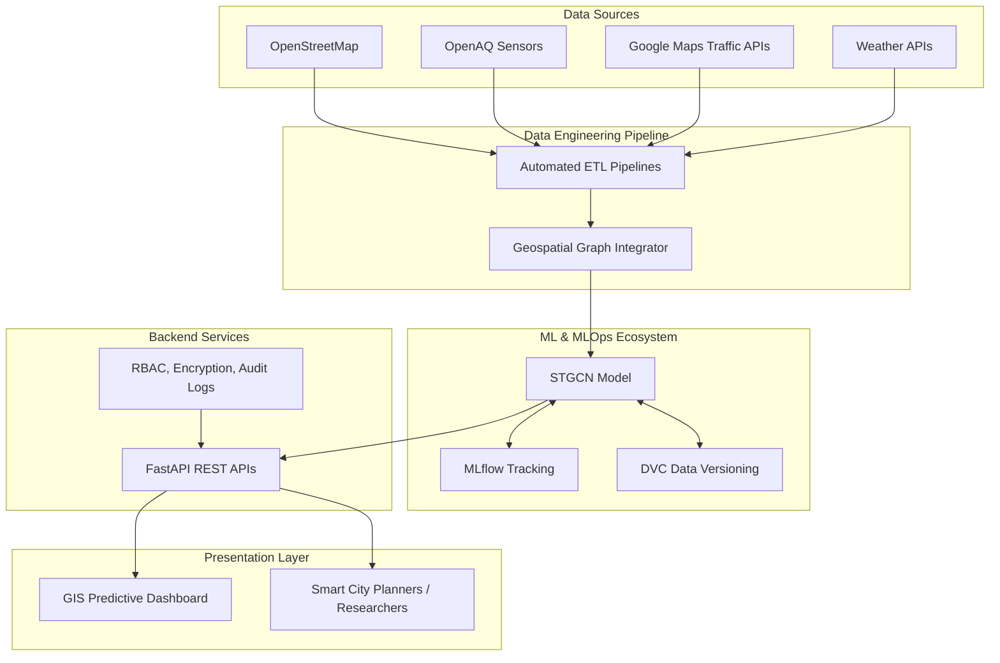

# System Architecture
## Hyper-Local Dhaka PM2.5 STGCN

### 1. High-Level Architecture

### 2. Component Details
- **Geospatial Graph Integrator**: Fuses various data streams to form nodes (intersections) and edges (road segments with traffic speeds and wind vectors).
- **STGCN Model**: Uses the spatial graph and temporal data to predict pollution diffusion.
- **FastAPI Layer**: Secure, scalable interface connecting the predictive engine to end-user applications.
